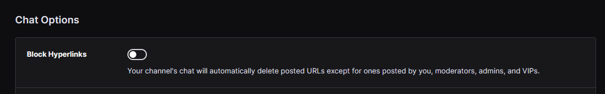
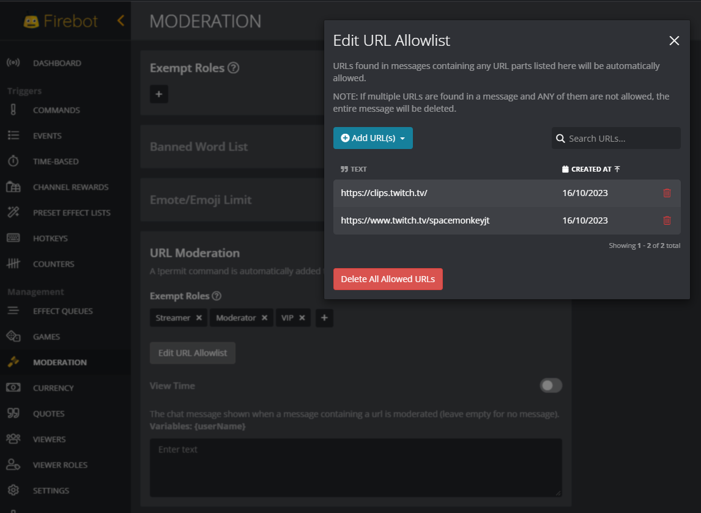
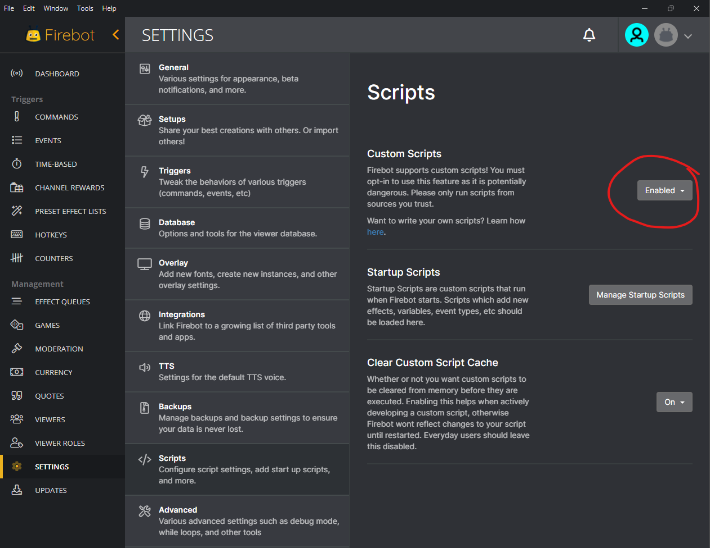
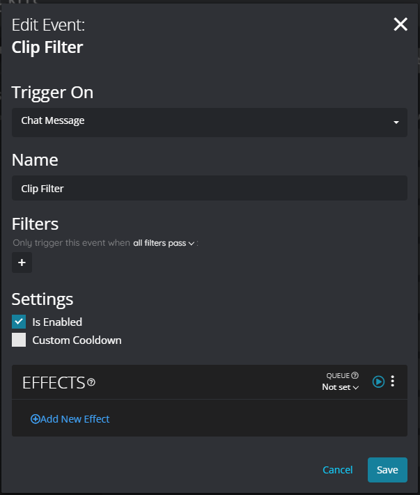
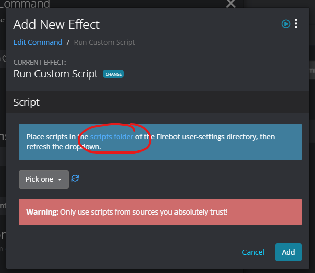
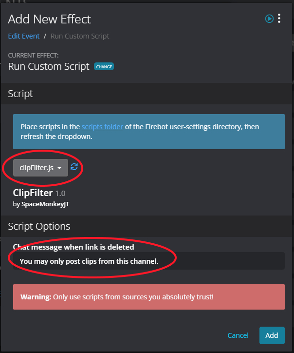

# ClipFilter custom script for Firebot

## What is it?

This is a custom script for [Firebot](https://firebot.app/) which deletes any posted clip links that are not for the broadcaster's channel.

Any links posted by the broadcaster, mods and vips are exempt.

## Download

[clipFilter.js](https://github.com/spacemonkeyJT/ClipFilter/releases/latest/download/clipFilter.js)

## How does it work?

Blocking all links except clips from the broadcaster's channel is tricky because many clip links don't contain the channel name, they're just https://clips.twitch.tv/some_id, so we can't just allow the links with a simple prefix. Therefore, the approach here is to use a custom script which looks up the clip and deletes the message if it's not for the broadcaster's channel.

To set this up, we need to do the following:

* Disable Twitch's inbuilt hyperlink blocking, to allow links to be posted
* Use a bot with URL moderation to delete all links except clips
* Use this custom script to further delete clip links that are not from the broadcaster's channel

Note that this means links are posted but then immediately deleted by the bot. This is subtly different than Twitch's blocking mechanism, which replaces the link with "***" before it ever gets posted. Using a bot to delete messages containing links instead means that users with browser extensions like BTTV may be able to still view deleted messages and access the links if they choose to.

## Allowing clip links

To allow clip links to be posted in chat, you'll first need to allow links to be posted in your [Twitch moderation settings](https://link.twitch.tv/moderation).

Ensure that the **Block Hyperlinks** option is **disabled**.

Next, you need to block all links except for clips, which come in a couple of formats.

* https://www.twitch.tv/your_username
* https://clips.twitch.tv/

This can be done by enabling URL Moderation in Firebot, and configuring the URL Allowlist. Alternatively, you can use another tool such as Streamlabs or StreamElements if you prefer. Make sure to exempt the streamer, mods and vips.

## Installing the script

In Firebot, click **SETTINGS** on the side bar, then **Scripts**, and enable **Custom Scripts** if it's not already enabled.

Add a new event to trigger on Chat Message, and give it a suitable name.

Add the **Run Custom Script** effect, and click **scripts folder** to open the scripts folder.

Download the [clipFilter.js](https://github.com/spacemonkeyJT/ClipFilter/releases/latest/download/clipFilter.js) file and save it into the scripts folder.

Click the refresh button and choose the **clipFilter.js** file, then edit the message parameter, or accept the default.

Click **Add** and save the command.

Now while this event is active, the script will trigger on chat messages, and delete messages containing clip links from other channels, unless posted by the broadcaster, or a moderator or vip.
